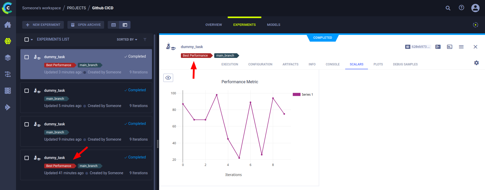
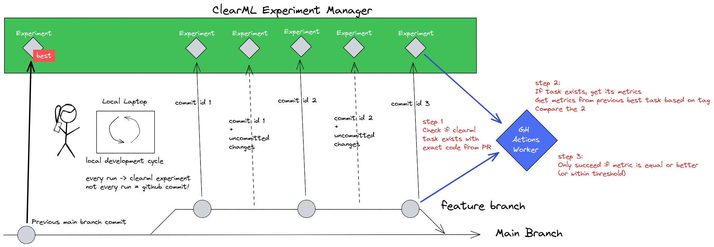

# GitHub Action For Detecting Model Degradation



The goal of this Github action is to check for possible model degradation and prevent PRs from being merged if the model is performing worse than before given the changes to the codebase. It is designed to be run on an open PR as a quality check, to ensure the performance consistency of the main branch. The workflow is detailed in the diagram below.



The propsed workflow is as follows.

The repository contains the model training code and a data scientist or ML engineer creates a new branch to build a new feature. We want to protect the main branch against model degradation so we add this action as a requirement to merge a PR. While developing the feature, we expect the code to be run many times, each time will be captured by the ClearML experiment manager, but not every run will correspond to a clean commit ID. During development one might run the code with uncommitted changes that will be captured by ClearML but not by git.

When the PR is opened or updated, the first thing we want to do is search for a ClearML task that was run with the exact code from the latest commit in the PR. We can do this by querying ClearML to make sure that:
- The commit hash captured in the task is equal to the commit hash of the current PR
- There are NO uncommitted changes logged on the ClearML task
- The ClearML task was successful

If all three of these requirements are met, it means one can assume that the code in the commit has successfully run on a developer machine at least once. If this is not the case, the pipeline will fail, we do not want to merge code that has not been proven to have run successfully before. If this is the case, we go to the next stage.

Now we can get the required performance metrics from this new task and compare them to the previous best task. We can search for the previous best task by looking in ClearML for the task that has the "best" tag. The name of this tag can be customized. The previous best tag should have the commit ID of the last commit in the main branch and no uncommitted changes, much like the requirements for task selection from above.

The relevant performance metric is extracted from both the new task and this previous best one and they are directly compared. If their difference is within the given threshold or the new one is better, the "best" tag will be moved from the previous best task to the new task, so that this cycle can continue.

## Example usage

```yaml
name: Compare models
on:
  pull_request:
    branches: [ main ]
    types: [ assigned, opened, edited, reopened, synchronize ]

jobs:
  detect-model-degradation:
      runs-on: ubuntu-20.04
      steps:
        - name: Compare models
          uses: thepycoder/clearml-actions-detect-model-degradation@main
          with:
            CLEARML_PROJECT: 'my_project' # CHANGE ME
            CLEARML_TASK_NAME: 'my_task' # CHANGE ME
            CLEARML_SCALAR_TITLE: 'Performance Metrics' # CHANGE ME
            CLEARML_SCALAR_SERIES: 'mAP' # CHANGE ME
            CLEARML_SCALAR_MIN_MAX: 'MAX' # CHANGE ME
            CLEARML_BEST_TAGNAME: 'BESTEST MODEL' # CHANGE ME (OR NOT ^^)
            CLEARML_SCALAR_THRESHOLD: 3 # CHANGE ME
            CLEARML_API_ACCESS_KEY: ${{ secrets.ACCESS_KEY }}
            CLEARML_API_SECRET_KEY: ${{ secrets.SECRET_KEY }}
            CLEARML_API_HOST: ${{ secrets.CLEARML_API_HOST }}
          env:
            COMMIT_ID: ${{ github.event.pull_request.head.sha }}
```

## Inputs

1. `CLEARML_API_ACCESS_KEY`: Your ClearML api access key. You can get on by following the steps [here](https://clear.ml/docs/latest/docs/getting_started/ds/ds_first_steps) or reuse one from you `clearml.conf` file. 
2. `CLEARML_API_SECRET_KEY`: Your ClearML api secret key. You can get on by following the steps [here](https://clear.ml/docs/latest/docs/getting_started/ds/ds_first_steps) or reuse one from you `clearml.conf` file. 
3. `CLEARML_API_HOST`: The ClearML api server address. If using the free tier, that's `api.clear.ml` if you have a self-hosted server, you'll have to point this to wherever it is deployed.
4. `CLEARML_PROJECT`: Which project to search in for the task.
5. `CLEARML_TASK_NAME`: Name of the task to compare to the current PR.
6. `CLEARML_SCALAR_TITLE`: Which scalar to use for comparison. Title of the scalar plot.
7. `CLEARML_SCALAR_SERIES`: Which scalar to use for comparison. Series to use within plot given by title.
8. `CLEARML_SCALAR_MIN_MAX`: Whether smaller is better (MIN) or larger is better (MAX). (default: "MAX")
9. `CLEARML_BEST_TAGNAME`: The name of tag to be given to the best task. Every task that is checked and is equal or better than the previous best will get this tag. (default: "Best Performance")
10. `CLEARML_SCALAR_THRESHOLD`: The threshold for the difference between the previous best and the current commit. This should be a percentage of the previous best. E.g. CLEARML_SCALAR_THRESHOLD=3 -> if previous best PR is metric value 100 and CLEARML_SCALAR_MIN_MAX is max, then current PR can have a minimum metric value of 97 while still passing. (default: 0)
